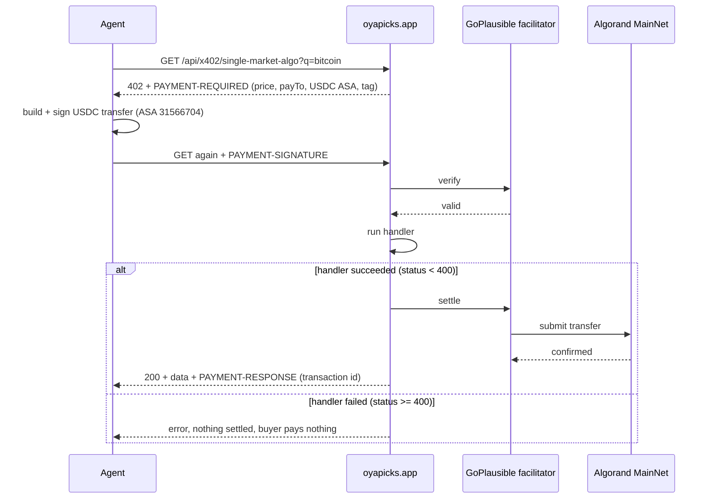

# OyaPicks x402

**Pay-per-call prediction market data for AI agents, settled in USDC on Algorand MainNet.**

Eleven endpoints. No API key, no account, no subscription. An agent sends a request, gets a `402 Payment Required` with the price, signs a USDC transfer, and gets the data back with the on-chain transaction ID attached.

This repo is the x402 layer of [oyapicks.app](https://oyapicks.app), exactly as deployed.

| | |
|---|---|
| Live service | https://oyapicks.app |
| Storefront | https://oyapicks.app/products |
| Discovery manifest | https://oyapicks.app/.well-known/x402 |
| For LLMs | https://oyapicks.app/llms.txt |
| Network | Algorand MainNet (`algorand:wGHE2Pwdvd7S12BL5FaOP20EGYesN73ktiC1qzkkit8=`) |
| Asset | USDC, ASA `31566704` |
| payTo | `NMVLONWVRZUTUSHOVJLPQZTKII4RNCHA33R5HRRWHBCHGMU4BLIKIJAVA4` |
| Facilitator | GoPlausible, `https://facilitator.goplausible.xyz`, Bazaar discovery on |
| Challenge tag | `x402-global-challenge` |
| X | [@OyaPicks](https://x.com/OyaPicks) |

---

## Try it in 60 seconds

```bash
cd examples/buyer
npm install

# Free: see the price and payment terms. Nothing is signed.
node buyer.mjs single-market-algo "bitcoin"

# Paid: one cent, settled on MainNet.
ALGO_MNEMONIC="your 25 words" node buyer.mjs single-market-algo "bitcoin" --pay
```

The paying wallet needs a little USDC (opted in to ASA `31566704`) and a little ALGO for the fee. Use a throwaway wallet with a dollar or two in it.

What you get back:

```
  402 Payment Required
    price     $0.01 USDC
    asset     ASA 31566704
    network   algorand:wGHE2Pwdvd7S12BL5FaOP20EGYesN73ktiC1qzkkit8=
    payTo     NMVLONWVRZUTUSHOVJLPQZTKII4RNCHA33R5HRRWHBCHGMU4BLIKIJAVA4
    scheme    exact
    tag       x402-global-challenge

  Paying from <your address>

  Data:
    { "product": "oyapicks-single-market", "found": true, "market": { ... } }

  Settled on-chain: <transaction id>
  Verify: https://lora.algokit.io/mainnet/transaction/<transaction id>
```

The buyer refuses to pay more than `MAX_USD` per call (default `0.25`, the price of the most expensive endpoint). The cap is checked before anything is signed and again as a client policy, so the signer never sees terms above it.

---

## Endpoints

All `GET`, all under `https://oyapicks.app/api/x402/`, all paid in USDC on Algorand MainNet.

| Endpoint | Price | Returns |
|---|---|---|
| `single-market-algo?q=` | $0.01 | The single highest-volume live market matching a keyword. Cheap enough to poll while watching a position. |
| `search-algo?q=` | $0.02 | All live markets matching a keyword, with venue, implied probability, 24h USD volume, end date. |
| `closing-soon-algo` | $0.02 | Markets resolving within 48 hours. |
| `movers-algo` | $0.03 | Biggest probability swings since the previous snapshot. |
| `new-markets-algo` | $0.03 | Markets listed since the previous snapshot. |
| `volume-spikes-algo` | $0.03 | Largest 24h volume jumps: previous and new volume, the multiple, percent change. |
| `probability-history-algo?q=` | $0.03 | A dated price series for one market. |
| `resolutions-algo` | $0.03 | Recently resolved Polymarket markets with the winning outcome. |
| `alpha-book` | $0.03 | The complete live Alpha Arcade catalog in one call, including multi-choice markets and per-outcome Algorand application IDs. |
| `arbitrage-algo` | $0.05 | The same outcome priced differently on Polymarket and Alpha Arcade, with the gap and the cheaper venue. |
| `analyze-algo` | $0.25 | Top 3 markets by 24h volume across both venues. |

Data comes from Polymarket and Alpha Arcade, normalized into one shape so an agent handles one schema instead of two APIs. Kalshi is deliberately excluded from every paid product because its data terms don't allow resale. Every function in `snapshot.ts` applies that filter, and every one is called by a published route.

Ten of these also exist on Base, paid in USDC through Coinbase's x402. `alpha-book` is Algorand only. The Base routes aren't in this repo.

---

## How a paid call works



---

## Repo layout

```
src/
  app/api/x402/<endpoint>/route.ts   one file per paid endpoint (11)
  lib/x402/algo-server.ts            the shared Algorand x402 resource server
  lib/x402/snapshot.ts               read side of the market snapshot layer
  lib/x402/arbitrage.ts              cross-venue matching for arbitrage-algo
  lib/types.ts                       the normalized Market type
  lib/supabase-admin.ts              server-only database client
public/
  .well-known/x402                   discovery manifest (x402.json is identical)
  llms.txt                           plain-language product list for LLMs
examples/buyer/
  buyer.mjs                          the working buyer client above
```

`@/` is the Next.js path alias for `src/`. The service runs on Next.js 16 on Vercel with Supabase for storage.

The whole Algorand integration is `algo-server.ts` plus a `withX402(...)` wrapper on each route. That's the point: adding a paid endpoint is one file.

---

## What's not here, and why

This is a reference repo, not a clone-and-run server. Three pieces live in a private codebase:

- **The venue fetchers** (`src/lib/markets/`). They read public Polymarket and Alpha Arcade APIs, and they're shared with a separate private system. `resolutions-algo`, `arbitrage.ts`, and `alpha-book` import from them, so those imports point at files that aren't here.
- **The snapshot writer.** A scheduled job writes a new snapshot row every 6 hours. Only the read functions ship here: exactly the code the paid endpoints execute for 8 of the 11 products.
- **Secrets and the Base routes.** No keys, no env files. Every credential is read from the environment.

The live endpoints are the proof. The buyer client pays them for real.

---

## Lessons from shipping on MainNet

Things that cost us time, written down so they don't cost you any.

**1. The two GoPlausible hosts are not interchangeable.** `https://facilitator.goplausible.xyz` supports Algorand MainNet. `https://x402.goplausible.xyz/facilitator` is TestNet only, and pointing a MainNet route at it fails with `Facilitator does not support scheme exact on network algorand:...`. Check before you deploy: `curl -s https://facilitator.goplausible.xyz/supported`.

**2. Declare Bazaar discovery output-only on Algorand.** Algorand routes that declared `required` inputs in their discovery schema didn't catalog in the GoPlausible Bazaar for us. Every route here declares only an `output` example, including the three that take `?q=`, and documents the query parameter in its description instead.

**3. A failed response costs the buyer nothing, so fail honestly.** In `@x402-avm/next` 2.6.1, `handleSettlement` returns early when the handler's status is 400 or above, before `processSettlement` runs. That makes an honest `503` strictly better than a stale or thinner payload under the same product name. `alpha-book` does exactly this when Alpha Arcade is down.

**4. Hook the lifecycle to see what the facilitator actually said.** `onAfterVerify`, `onVerifyFailure`, `onAfterSettle`, and `onSettleFailure` on the resource server are pure instrumentation. They were how we finally saw real verify and settle results instead of guessing. See `algo-server.ts`.

**5. Trust the transaction, not the 200.** The buyer prints the settlement transaction ID from the `PAYMENT-RESPONSE` header so anyone can check it on-chain. An HTTP 200 alone proves nothing about whether money moved.

**6. The AVM client builds against TestNet unless you tell it otherwise** (`@x402-avm/avm` 2.6.1). This one cost us a failed MainNet payment:
- `ExactAvmScheme` picks its Algorand node with `algodUrl ?? DEFAULT_ALGOD_TESTNET`. Leave out `algodUrl` and it fetches TestNet transaction parameters even when the server asked for MainNet. The facilitator then rejects the payment with `Transaction genesis hash does not match expected network`.
- Fix: always pass the node explicitly. The package exports `NETWORK_TO_ALGOD`, so `new ExactAvmScheme(signer, { algodUrl: NETWORK_TO_ALGOD[network] })` matches the node to whatever network the 402 asked for. The buyer does exactly this, and `ALGOD_URL` overrides it.
- Also: the package README shows `ExactAvmClient`, but the actual export is `ExactAvmScheme` from `@x402-avm/avm/exact/client`. Build the signer with `toClientAvmSigner(base64Key)` from `@x402-avm/avm`.
- If a payment is rejected, the reason arrives in the `PAYMENT-REQUIRED` header of the second 402, not in the body. The buyer prints it.

**7. Alpha Arcade's API has quirks worth knowing up front.** Prices come in microunits (divide by 1,000,000). The useful 24h volume is in `twentyFourHrVolume`, while `volume` is often 0. End timestamps are in milliseconds. Markets are either binary or multi-choice with an `options[]` array. The live-markets call returns the entire catalog in one response with no pagination (967 markets when we checked).

**8. A multi-choice price is not a YES price.** In a multi-choice market, `outcomePrices[0]` is one candidate's price. Pairing it against a Polymarket binary YES produces fake arbitrage. `arbitrage.ts` only joins on an exact (tournament, team) pair, with team names normalized so "Congo DR" matches "DR Congo".

**9. Filter before you cap.** Alpha's live list includes recently ended 5- and 15-minute crypto markets, priced at 0 but still carrying 24h volume. Taking the top 60 by volume first and filtering second let them crowd out up to 45 of the 60 slots. Filter out ended and unpriced markets first, then cap.

**10. Polymarket's `/markets` endpoint returns at most 100 markets per request.** We asked for 600 and got exactly 100. Individual team futures ("Will the Yankees win the 2026 World Series?") never trade enough to reach that top 100, so a scanner that pulls by volume and then looks for tournaments silently finds nothing. `arbitrage.ts` now fetches each tournament's event directly with `/events?slug=...`, which returns every team market in it, and reads Alpha's whole catalog instead of its top 40.

---

## Track record

The same data pipeline backs a public, verifiable prediction track record: https://oyapicks.app/track

---

Built by Christopher Williams ([@OyaPicks](https://x.com/OyaPicks)) in Hawaii. Informational data only, not financial advice.
